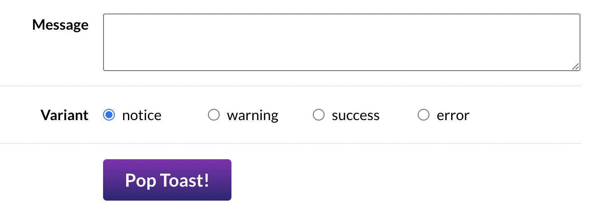
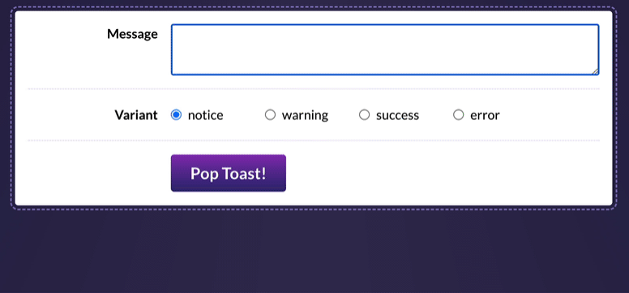
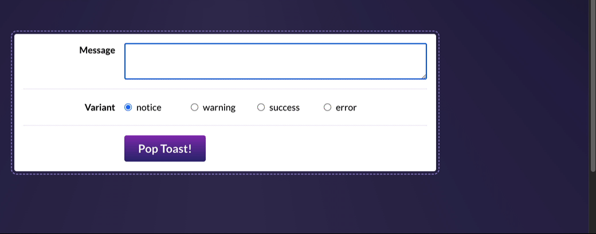

# Toast Component Project

## Joy of React, Project II

In this project, we'll dive deep into the implementation of a single common UI component: A `<Toast>` message component.


---

## Exercise 1: Wiring up form controls

In order to test our `Toast` component, we'll start by building a little playground. This will allow us to test our component throughout development.



In `ToastPlayground.js`, you'll find most of the markup you'll need, but there are two problems:

1. All of the inputs are _uncontrolled_, meaning we can't easily access their values in React. We should use React state to drive all form controls.
2. We're only given a single radio button. We need one for each valid variant.

Our `Toast` component should support 4 different variants:

- notice
- warning
- success
- error

**This first exercise is meant to be a review of the concepts learned in Module 1 and Module 2.** So, it might be worth brushing up on some of those earlier lessons. In particular, the [Input Cheatsheet bonus lesson](https://courses.joshwcomeau.com/joy-of-react/02-state/11-bonus-cheatsheet) has some handy info about binding different types of form inputs!

**Acceptance Criteria:**

- The “Message” textarea should be driven by React state
- Using the data in the `VARIANT_OPTIONS` array, render 4 radio buttons within the “Variant” row. They should all be part of the same group (so that only one can be selected at a time). They should also be driven by React state.
- There should be no key warnings in the console.

---

## Exercise 2: Live-editable toast preview

Inside `src/components`, you'll find a `Toast` component. This component includes the basic DOM structure you'll need, but **it's entirely static right now.** It doesn't accept any props!

Your mission in this exercise is to render the `Toast` component within `ToastPlayground` and allow the playground to customize the Toast using the state we set up in the previous exercise. We should also figure out a "dismissal" mechanism, so that the close button functions.

Here's what it should look like, when you've solved this exercise:



For now, you can import the `Toast` component in `ToastPlayground` and render it between the header and the controls:

```jsx
<header>
  
  <h1>Toast Playground</h1>
</header>

{/* Place a <Toast /> here! */}

<div className={styles.controlsWrapper}>
  <div className={styles.row}>
```

**It's up to you to come up with the best possible “Prop API” for this component!**

If you get stuck, you may wish to review the following lessons from the course:

- [Styling in React, exercises](https://courses.joshwcomeau.com/joy-of-react/01-fundamentals/09.02-styling-exercises)
- [Slots, exercises](https://courses.joshwcomeau.com/joy-of-react/04-component-design/07.01-slots-exercises) (Especially the stretch goal from the first exercise!)

**Acceptance Criteria:**

- The toast component should show the message entered in the textarea, essentially acting as a “live preview”.
- The toast's styling should be affected by the “variant” selected:
  - The colors can be set by specifying the appropriate class on the top-level `<div>`. By default, it's set to `styles.notice`, but you'll want to dynamically select the class based on the variant (eg. for a success toast, you'll want to apply `styles.success`).
  - The icon can be selected from the `ICONS_BY_VARIANT` object. Feel free to re-organize things however you wish!
- The toast should be hidden by default, but can be shown by clicking the "Pop Toast!” button.
- The toast can be hidden by clicking the “×” button within the toast.

---

## Exercise 3: Toast shelf

One of the core defining characteristics of toast notifications is that they stack!


Your mission in this exercise is to restructure things so that our `ToastPlayground` allows us to create _multiple_ toasts.

To help in your quest, you'll find a `ToastShelf` component in this project. It will automatically apply the styles and animations.

You'll need to replace the `Toast` live demo with this new `ToastShelf` component, inside `ToastPlayground`:

```diff
<header>
  
  <h1>Toast Playground</h1>
</header>

- <Toast />
+ <ToastShelf />

<div className={styles.controlsWrapper}>
  <div className={styles.row}>
```

By the end of this exercise, it should look like this:



**This is a very tricky exercise.** If you're not sure where to start / how to make this work, I share some [hints on the course platform](https://courses.joshwcomeau.com/joy-of-react/project-toast/03-hints).

Some lessons that might help, from the course:

- [The onClick Parable](https://courses.joshwcomeau.com/joy-of-react/02-state/04.02-on-click-parable)
- [Dynamic key generation](https://courses.joshwcomeau.com/joy-of-react/02-state/07-key-generation)

**Acceptance Criteria:**

- Instead of live-editing a single Toast instance, the playground should be used to push new toast messages onto a stack, rendered inside `ToastShelf` and shown in the corner of the page.
- When “Pop Toast!” is clicked, the message/variant form controls should be reset to their default state (`message` should be an empty string, `variant` should be "notice").
- Clicking the “×” button inside the toast should remove that specific toast (but leave the rest untouched).
- A proper `<form>` tag should be used in the `ToastPlayground`. The toast should be created when submitting the form.
- **There should be no key warnings in the console!** Keys should be unique, and you should not use the index.

---
